<h1 align="center">Commerce Agent Protocol</h1>

<p align="center">
  <strong>Open protocol connecting e-commerce catalogs to AI shopping agents.</strong><br/>
  The Stripe of agent commerce — neutral middleware between merchants and Claude / ChatGPT / Perplexity / Operator.
</p>

<p align="center">
  
</p>

<p align="center">
  <a href="https://github.com/teocomyn/commerce-agent-protocol/blob/main/LICENSE"></a>
  <a href="https://github.com/teocomyn/commerce-agent-protocol/actions/workflows/ci.yml"></a>
  <a href="https://github.com/teocomyn/commerce-agent-protocol/issues"></a>
  <a href="https://github.com/teocomyn/commerce-agent-protocol/stargazers"></a>
  <a href="https://github.com/teocomyn/commerce-agent-protocol/releases"></a>
</p>

---

## Why CAP?

Today, when an AI agent wants to buy something for a human, it scrapes HTML, guesses prices, and clicks "Add to cart" buttons that weren't designed for it. It's slow, brittle, and breaks every time a merchant redesigns their store. On the merchant side, getting an AI agent to actually finalize a transaction is impossible — there's no protocol, no standard, no shared language.

**CAP fixes that.** It's a neutral, open layer — not owned by Shopify, Google, or OpenAI — that lets any merchant expose an agent-readable catalog and any agent execute a transaction through a clean, signed API. The spec is free; the reference SaaS is what merchants pay for if they don't want to implement it themselves.

> If this protocol is going to exist anyway, the question is: *who writes it before the giants do.*

---

## What CAP gives you

| Pillar | What it does |
|--------|--------------|
| **1. Agent-readable catalog format** | A versioned JSON schema for products, variants, stock, prices, certifications, shipping, returns — designed to be read by an LLM, not a human. |
| **2. Transaction API** | `/v1/search` (semantic, vector), `/v1/compare` (matrix), `/v1/checkout/initiate` (Shopify Cart API). Authenticated by API keys, rate-limited per plan. |
| **3. MCP server** | Stdio MCP server with `commerce_search`, `commerce_compare`, `commerce_checkout` tools. Plug-and-play in Claude Desktop, Cursor, or any MCP client. |

This repository contains both the **spec** (open, versioned in [`cap-spec/`](./cap-spec)) and the **reference implementation** (this monorepo).

---

## Architecture

```
Shopify ──► OAuth ──► Catalog sync (BullMQ)
                          │
                          ▼
                    Postgres + pgvector ──► /v1/search (vector + filters)
                          │                  /v1/compare
                          │                  /v1/checkout/initiate (Cart API)
                          │
                          └─► MCP stdio (commerce_search / compare / checkout)
                                         │
                                         ▼
                              Claude · ChatGPT · Perplexity · Operator
```

Diagrams: [`cap_system_architecture_overview.svg`](./cap_system_architecture_overview.svg) · [`cap_data_flow_product_to_agent.svg`](./cap_data_flow_product_to_agent.svg)

---

## Quick start

**Requirements:** Node ≥ 22, pnpm ≥ 9, Docker.

```bash
# 1. Local Postgres (with pgvector) + Redis
docker compose up -d

# 2. Environment
cp .env.example .env
# Fill in at minimum: DATABASE_URL, REDIS_URL, OPENAI_API_KEY,
# ENCRYPTION_KEY (32+ chars), and SHOPIFY_* if you connect a store.

# 3. Install + DB schema
pnpm install
pnpm db:generate
pnpm db:migrate   # uses prisma migrate deploy

# 4. Run API + dashboard
pnpm dev
```

API on **`http://localhost:3000`**, dashboard on **`http://localhost:3001`**.

**Workers** (catalog sync + LLM enrichment) run as separate processes:

```bash
pnpm --filter=@cap/api exec tsx watch src/workers/enrichment.worker.ts
pnpm --filter=@cap/api exec tsx watch src/workers/catalog-sync.worker.ts
```

**Try the API:**

```bash
# Live OpenAPI spec
curl http://localhost:3000/openapi.json | jq

# Search (after creating a CAP API key in the dashboard)
curl -X POST http://localhost:3000/v1/search \
  -H "X-CAP-Key: cap_live_..." \
  -H "Content-Type: application/json" \
  -d '{"query":"white eco-friendly sneakers under 120","limit":3}'
```

**Run as MCP server** (stdio, for Claude Desktop / Cursor):

```bash
MCP_MODE=true CAP_MERCHANT_ID=<merchant-uuid> pnpm --filter=@cap/api dev
```

---

## Repository layout

| Path | What lives here |
|------|-----------------|
| `apps/api` | Hono API — OAuth, webhooks, search/compare/checkout, MCP server |
| `apps/dashboard` | Next.js 15 dashboard — merchant overview, products, API keys |
| `packages/db` | Prisma schema + migrations + client |
| `packages/shared` | Zod schemas, GEO score, utilities shared across packages |
| `cap-spec/` | The CAP protocol specification (versioned, language-agnostic) |
| `.github/` | Issue / PR templates, CI workflow, CODEOWNERS |

---

## Status

CAP is **alpha (v0.1)**. The catalog + search + checkout loop works end-to-end against a real Shopify store; the open spec is being formalized in [`cap-spec/`](./cap-spec). Breaking changes are expected before v1.0.

See the [CHANGELOG](./CHANGELOG.md) for the full release history.

---

## Contributing

We welcome contributions of all sizes — from typo fixes to new platform adapters (WooCommerce, Salesforce Commerce, custom carts).

1. Read the [Contribution guide](./CONTRIBUTING.md)
2. Check [open issues](https://github.com/teocomyn/commerce-agent-protocol/issues) labeled `good first issue`
3. For protocol changes, open a [Spec Proposal](./.github/ISSUE_TEMPLATE/spec_proposal.md)

By participating, you agree to abide by our [Code of Conduct](./CODE_OF_CONDUCT.md).

To report a security vulnerability, see [SECURITY.md](./SECURITY.md).

---

## Community

- **Discussions** — [GitHub Discussions](https://github.com/teocomyn/commerce-agent-protocol/discussions)
- **Issues** — [GitHub Issues](https://github.com/teocomyn/commerce-agent-protocol/issues)
- **Security** — security@cap-protocol.org (private disclosure)

---

## License

CAP is licensed under the [Apache License 2.0](./LICENSE) — including an explicit patent grant. The protocol itself is free to implement, fork, or embed.
